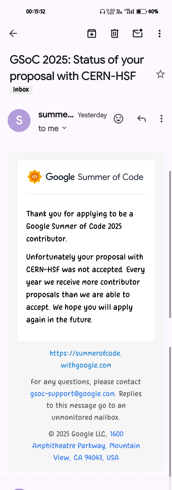

# GSoC-2025

 

 
 

 
 

 

  
  
  

 
 

---

## Mar 25

 

 

 

 

 

---

## using ChartGPT

---

Based on your background in **mechanical engineering, IoT, microcontrollers, cloud technology, security (DevOps/DevSecOps), and physics/mathematics**, here are the best GSoC 2025 projects from CERN that align with your skills: [Web Site](https://hepsoftwarefoundation.org/gsoc/2025/summary.html)

### **Top Project Recommendations**  
1. **CernVM-FS: Evaluate Distribution of ML model files on CVMFS**  
   - **Why?** You have experience in **cloud computing and DevOps**. This project focuses on distributing ML models efficiently in a cloud-like environment using **CernVM-FS (CERN Virtual Machine File System)**.  
---
2. **Ganga: Incorporate a Large Language Model to assist users**  
   - **Why?** Since you are interested in **AI/ML** and DevSecOps, this project involves integrating an LLM into Ganga, a Python-based tool for managing large-scale physics workflows.  
---
3. **Clad: Enhancing LLM Training with Clad for efficient differentiation**  
   - **Why?** If you're interested in **AI/ML and performance optimization**, this project enhances training for large models using **automatic differentiation** in Clad, a tool that optimizes C++ computations.  
---
4. **CppInterOp: Implement CppInterOp API exposing memory, ownership, and thread safety information**  
   - **Why?** You have **C++ and Python** knowledge, and this project focuses on improving C++ interoperability, which is useful in **high-performance computing** and DevSecOps.  
---
5. **MCnet: MCnet/OpenData - tools and exercises for open-data exploration with MC simulations**  
   - **Why?** Since you're a **physics and mathematics lover**, this project involves **Monte Carlo simulations** for particle physics. It will allow you to work with open data and scientific computing tools.  
---
6. **SMARTHEP: Estimating the energy cost of ML scientific software**  
   - **Why?** If you're interested in **cloud cost optimization (FinOps)**, this project estimates the **energy cost of ML workloads**, which is useful in DevOps and cloud resource management.  
---
7. ✅ **BEAD: [Background Enrichment augmented Anomaly Detection (BEAD) for new physics searches at LHC](https://hepsoftwarefoundation.org/gsoc/2025/proposal_SMARTHEP_BEAD.html)**  
   - **Why?** You have experience in **data analysis (Taguchi method, Minitab software)**. This project focuses on **anomaly detection in physics data**, which is closely related to your **IoT data analysis projects**.  
---
### **Alternative Choices (If you want to focus more on security & IoT)**  
- **Xeus-Cpp: Implementing Debugging Support** (Good for C++ debugging in scientific computing)  
- **ROOT: RNTuple in JSROOT** (If you want to work on structured data for physics applications)  
- **ML4EP: TMVA SOFIE - GPU Support for Machine Learning Inference** (If you're interested in **AI acceleration & DevOps**)  
---
### **Best Strategy**  
- **Step 1:** Pick a project that aligns with your DevOps/DevSecOps, cloud, or IoT expertise.  
- **Step 2:** Start **learning and contributing** to the project's GitHub repo (if available).  
- **Step 3:** Contact the project maintainers or mentors early to express interest.  
- **Step 4:** Build a small demo project related to the topic to showcase your skills in the proposal.  

### **Final Recommendation**  
Your best pick is **CernVM-FS (Cloud & DevOps)** or **SMARTHEP (FinOps & ML cost estimation)**, followed by **Ganga (AI in scientific computing)** or **BEAD (Physics & data analysis)**. 

---
---

✅ This BEAD project in GSoC 2025 aligns well with your **data analysis, cloud computing, and machine learning interests**, given your experience with **Minitab for electroplating optimization, IoT projects, and DevOps/DevSecOps knowledge**.  

### **Why BEAD is a Good Fit for You?**  
1. **Data Analysis Experience** – You have worked with **Taguchi analysis in Minitab**, making you familiar with **pattern recognition and optimization**, which is crucial for anomaly detection in physics data.  
2. **Python & ML** – You have **some experience with Python**, and this project involves **deep learning, auto-encoders, transformers, and Graph Neural Networks (GNNs)**.  
3. **Linux & Cloud Knowledge** – Since you are interested in **cloud computing & DevOps**, working with **Python in a Linux environment** will be a natural extension.  
4. **Physics Background** – Your **love for physics and mathematics** makes this project ideal, as it involves **particle physics, high-energy physics (HEP) datasets, and unsupervised learning techniques**.  

---

### **How to Prepare for BEAD GSoC 2025?**  
1. **Learn Unsupervised ML Algorithms:**  
   - Study **autoencoders**, **transformers**, **GNNs**, and **probabilistic models**.  
   - Explore **Anomaly Detection in Machine Learning** (Isolation Forest, Variational Autoencoders, etc.).  

2. **Get Comfortable with BEAD’s Tech Stack:**  
   - **Python** (NumPy, Pandas, SciPy, Matplotlib)  
   - **PyTorch** (for Deep Learning models)  
   - **Jupyter Notebooks** (for visualizing data)  
   - **ROOT Framework** (used in HEP data processing)  
   - **Linux** (basic CLI, working with servers)  

3. **Start Contributing to BEAD’s GitHub Repository:**  
   - Check open issues and documentation.  
   - Try replicating their results on small datasets.  
   - Contact mentors early (Pratik Jawahar, Sukanya Sinha) to ask how you can contribute before GSoC starts.  

4. **Practice Physics-Based Data Analysis:**  
   - Work on **simulated physics datasets** to understand event-level & object-level data.  
   - Use **Matplotlib** for visualization.  
   - Study **HEP data representation** (ROOT, CERN Open Data).  

---

### **Final Steps**  
- **Choose a Task Idea:** Either **develop a new autoencoder model** or **test models on different datasets**.  
- **Write a Strong Proposal:** Clearly explain how your **past experience (Minitab, IoT, Python, Cloud)** will help improve BEAD.  
- **Reach Out to Mentors on CERN’s GSoC Discussions** (ask for guidance on starter issues).

---

 

### May 9 2025, 00:19

